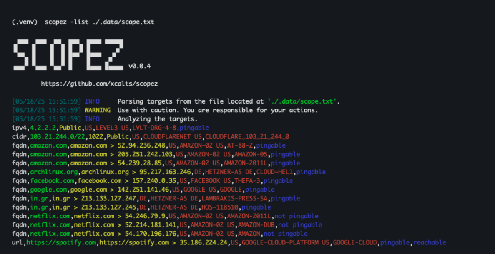

<a id="readme-top"></a>

[![Python][python-shield]][python-url]
[![Contributors][contributors-shield]][contributors-url]
[![Lint][lint-shield]][lint-url]
[![Stargazers][stars-shield]][stars-url]
[![Issues][issues-shield]][issues-url]
[![MIT License][license-shield]][license-url]

<!-- PROJECT LOGO -->
<br />

<div align="center">
  <a href="https://github.com/xcalts/scopez">
    
  </a>
  <p align="center">
    Scopez is a Python-based target analysis tool built with simplicity in mind.
    <br />
    <br />
    <a href="https://github.com/xcalts/scopez/issues/new?labels=bug&template=bug-report---.md">Report Bug</a>
    ·
    <a href="https://github.com/xcalts/scopez/issues/new?labels=enhancement&template=feature-request---.md">Request Feature</a>
  </p>

  

</div>

## Features

- Parses a file filled with targets
- Does IP networks **math**
- Captures **RDAP** data
- **Pings** IPs and FQDNs
- Displays **DNS chains**
- Bash friendly output
- Multiple input support - **STDIN/FILE/CIDR/IP/FQDN**
- Multiple output support - **TABLE/JSON/TXT/STDOUT**

<p align="right">(<a href="#readme-top">back to top</a>)</p>

## TODOs

- Input support - **URL, IP with port, FQDN with port**
- **Proxies** support for URL probing
- **Markdown** output

<p align="right">(<a href="#readme-top">back to top</a>)</p>

## Usage

```
Usage: scopez [OPTIONS]

DEBUG:
  -version   Show the version and exit.
  -no-color  Disable colors in CLI output.
  -silent    Display only results in output.

INPUT:
  -target           Targets to analyze (comma-separated).
  -list             List of targets to analyze (file).
  -exclude-targets  Targets to exclude from analysis (comma-separated).
  -exclude-file     List of targets to exclude from analysis (file).

OUTPUT:
  -output  File to write output to (optional).
  -json    Write output in JSON lines format.
  -table   Write output in Table format.

OTHER:
  -help  Show this message and exit.
```

<p align="right">(<a href="#readme-top">back to top</a>)</p>

## Developing

In order to start developing you will need to to follow the instructions below.

```txt
> pyenv install 3.12.6
> pyenv global 3.12.6
> python3 -m venv .venv
> source .venv/bin/activate
> (.venv) pip install ruff pre-commit
> (.venv) pip install -e .
> (.venv) scopez --version
```

<p align="right">(<a href="#readme-top">back to top</a>)</p>

## Building Standalones

Follow the instructions below to build a standalone `scopez` executable.

> Note: currently only `elf` standalone executables are supported.

**Linux**

```txt
> python3 -m venv .venv
> source .venv/bin/activate
> (.venv) pip install -e .
> (.venv) pip install --upgrade cx_Freeze
> (.venv) python3 setup_cx.py build
```

<p align="right">(<a href="#readme-top">back to top</a>)</p>

## Dependencies

- [click](https://github.com/pallets/click)
- [requests](https://github.com/psf/requests)
- [rich](https://github.com/Textualize/rich)
- [pydantic](https://github.com/pydantic/pydantic)
- [ipwhois](https://github.com/secynic/ipwhois)

<p align="right">(<a href="#readme-top">back to top</a>)</p>

## Contributing

Any contributions you make are **greatly appreciated**.

If you have a suggestion that would make this better, please fork the repo and create a pull request.
You can also simply open an issue with the tag "enhancement".

1. Fork the Project.
2. Create your Feature Branch (`git checkout -b feature/AmazingFeature`).
3. Commit your Changes (`git commit -m 'Add some AmazingFeature'`).
4. Push to the Branch (`git push origin feature/AmazingFeature`).
5. Open a Pull Request.

<p align="right">(<a href="#readme-top">back to top</a>)</p>

<!-- MARKDOWN LINKS & IMAGES -->
<!-- https://www.markdownguide.org/basic-syntax/#reference-style-links -->

[contributors-shield]: https://img.shields.io/github/contributors/xcalts/scopez.svg?style=for-the-badge
[contributors-url]: https://github.com/xcalts/scopez/graphs/contributors
[lint-shield]: https://img.shields.io/github/actions/workflow/status/xcalts/scopez/ruff.yml?style=for-the-badge&label=ruff
[lint-url]: https://github.com/xcalts/scopez/actions/workflows/ruff.yml
[stars-shield]: https://img.shields.io/github/stars/xcalts/scopez.svg?style=for-the-badge
[stars-url]: https://github.com/xcalts/scopez/stargazers
[issues-shield]: https://img.shields.io/github/issues/xcalts/scopez.svg?style=for-the-badge
[issues-url]: https://github.com/xcalts/scopez/issues
[license-shield]: https://img.shields.io/github/license/xcalts/scopez.svg?style=for-the-badge
[license-url]: https://github.com/xcalts/scopez/blob/master/LICENSE
[python-shield]: https://img.shields.io/badge/-python-blue?style=for-the-badge
[python-url]: https://www.python.org/
